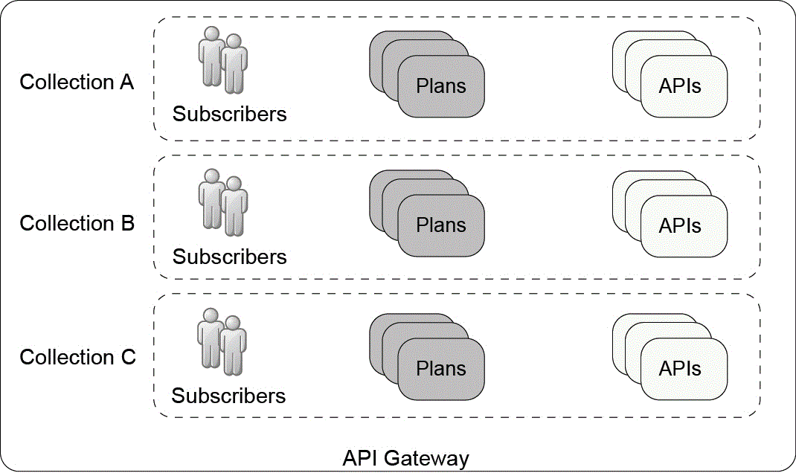

# API Gateway {#apigw_overview .concept}

An API Gateway receives API requests and routes the request to a matching API that is provisioned natively in the API Gateway. The API Gateway then runs the assembly of the API to respond to the request.

You can develop and manage the following types of APIs on the DataPower® Gateway.

 REST API
 :   Indicates a REST API that is compliant with version 2.0 of the Swagger specification.

  OAuth API
 :   Indicates an OAuth 2.0 provider API that contains the authorization and token endpoints of an OAuth flow.

 The API Gateway allows you to manage APIs in the following pattern:

-   You can develop APIs in the DataPower Gateway by creating each API as an API definition configuration.
-   You can secure APIs by defining security requirements at the API-level and the operation-level.
-   You can expose an API for client access by adding the API into an API plan. You can package a list of APIs in an API plan and define the rate limit settings for the plan.
-   To access an API in DataPower, a client must subscribe to at least one API plan that contains the target API. You can create subscriber profiles to be used for client identification. A client is identified through API keys that are carried in the request.

    As shown in [Figure 1](#subscription):

    -   Subscriber X is allowed to access API set 1 and API set 2 through Plan A.
    -   Subscriber Y is allowed to access API set 2 through Plan B.
    -   Subscriber Z is allowed to access API set 3 through Plan C.
    Therefore, to access an API in API set 2, the client must be identified as subscriber X or Y.

    

In addition to the common API management pattern, the API Gateway provides the following IBM extensions to the standard Swagger specification.

## API collection { .section}

An API collection allows you to group a set of plans and subscribers to make APIs available to a specific group of API clients. An API Gateway can comprise one or more collections.

The APIs in a collection are served on a specific path, which is called routing prefix. To access the APIs in a collection, the URL of the API request must match the URL that is formed by the routing prefix of the collection, the base path of the API, and the relative path to the target API operation.

[Figure 2](#container) shows an API Gateway with three API collections, each collection packages a set of subscribers and plans. To access an API in collection A, the URL of the API request must contain the routing prefix of collection A.

## Assembly { .section}

You can assemble processing actions where each action acts on different contexts of an API call to complete the required API operation. The configuration that assembles the processing actions is an assembly. The API Gateway responds to an API request by running the assembly of the matching API. An assembly consists of an assembly rule and a set of error handling policies.

-   An assembly rule comprises various processing actions to act on the API context.
-   An error handling policy defines how to handle a specific error.

## API property { .section}

You can create custom API properties for an API. The property value can vary with the API collection that the API is provisioned in. The collection-specific API properties allow you to use the same API definition in different API collections where each collection is slightly different from each other.

-   **[Routing of API requests](apigw_apirequestrouting.md)**  
When API Gateway receives an API request through the handlers, the API Gateway first routes the request to a matching API collection. When the collection is matched, the API Gateway triggers the API processing rule of the API collection to execute the required API operation and respond to the API request. The API processing rule comprises a set of API actions in a defined sequence.
-   **[Developing APIs](apigw_configuringapi.md)**  
The DataPower Gateway stores each API as an API definition configuration. To develop an API, create an API definition.
-   **[Creating an API Gateway](apigw_configuringapigw.md)**  
How to configure an API Gateway. This information is the high-level procedure to create an API Gateway.
-   **[Viewing and deleting API rate limit enforcement records](apigw_ratelimit_view_delete_records.md)**  
How to view and delete API rate limit enforcement records.
-   **[apim extension elements and functions](apigw_extensions.md)**  
The `apim` extension elements and functions documentation provides information about how to use the API Gateway extension elements and functions to manipulate the API context.
-   **[GatewayScript APIs for API management](apigateway_gatewayscript_general.md)**  
The GatewayScript programming in API Gateway follows the programming guidelines of the DataPower Gateway Gateway programming model.
-   **[Variables in the API context](apigw_contextvariables.md)**  
An API context is a set of variables. The input and output of the processing and assembly actions are stored in these variables. You can access and manipulate these variables by referencing them through assembly actions.

**Related information**  

[Swagger specification version 2.0: http://swagger.io/specification/](http://swagger.io/specification/)

